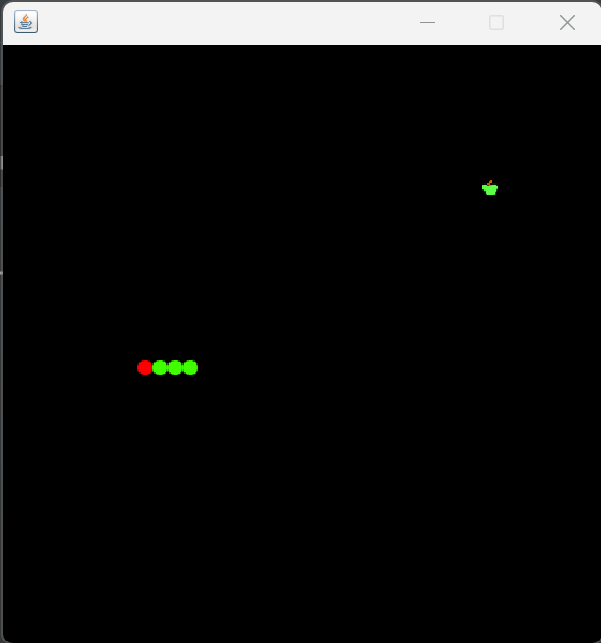
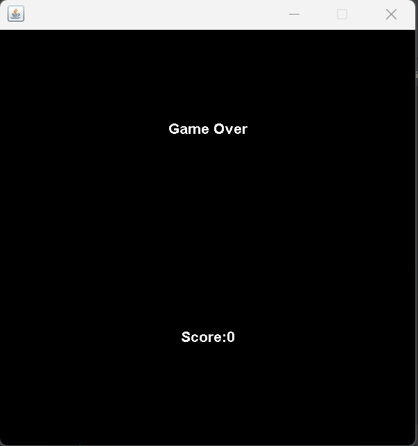
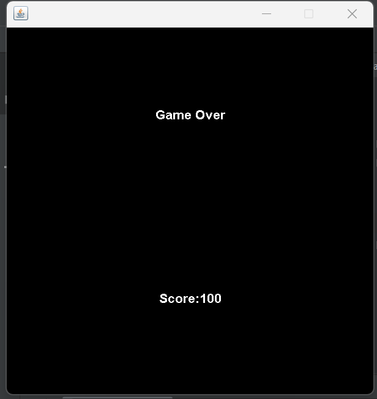

# Snake-Game
* To make the game, the following features need to be implemented:
* Basic UI, which includes the frames, content, content pane, dimensions, and color of the background.
* Graphics, which involves loading images and drawing components on the right position.
* Mechanics of the snake, which covers its movement and how it eats food.
* Control of the snake using arrow keys.
* Checking for collisions with the border and the body.
* Displaying the score and game over message when the game ends.
* The only technology used for making the Snake game is Java Swing library, which provides lightweight components for making window-based applications.
* Classes that will be used in the game include J Button, J check boxes, combo box, J File Chooser, and J Frame.

 
   
